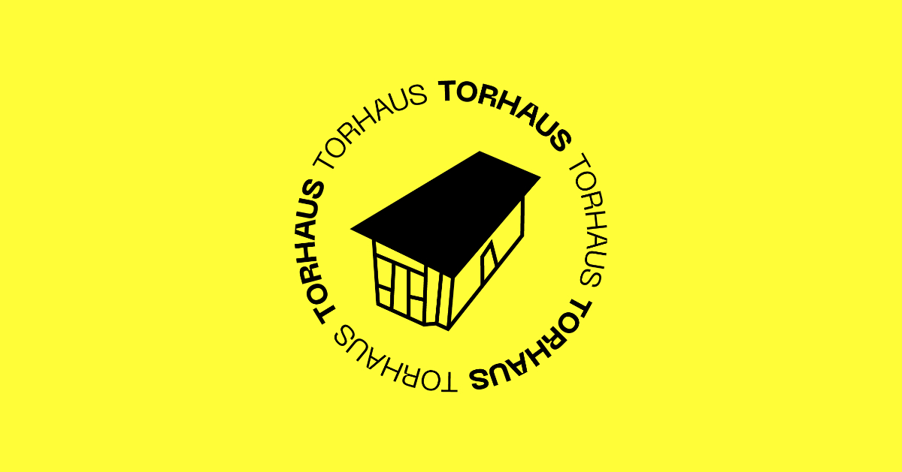

# Torhaus Berlin e.V.

Official website for **[Torhaus Berlin e.V.](https://torhausberlin.de)** — a self-organised community space housed in the 55 m² gatehouse at Tempelhof Airport.

The stack is **[Payload CMS 3](https://payloadcms.com)** (headless CMS and admin UI) and **[Next.js 16](https://nextjs.org)** (App Router) in a single Node app. Content is **localized** in English and German (`en` / `de`) via **[next-intl](https://next-intl.dev)**.

## Stack

| Layer     | Technology                                     |
| --------- | ---------------------------------------------- |
| Framework | Next.js 16 (App Router), React 19, TypeScript  |
| CMS       | Payload 3                                      |
| Database  | **MongoDB** (`@payloadcms/db-mongodb`)         |
| i18n      | next-intl (`localePrefix: 'as-needed'`)        |
| Styling   | Tailwind CSS 4, shadcn/ui-style components     |
| Media     | Sharp, configurable image sizes (including OG) |

## Core features

- **Collections** — Pages, Posts, Projects (CMS-managed listings), Media, Categories, Users
- **Layout builder** — Pages (and post bodies) are built from composable blocks (see below)
- **Lexical** rich text, drafts & versions, live preview breakpoints in the admin
- **Globals** — Header and Footer navigation / content
- **Plugins** — SEO fields, redirects, nested categories, form builder
- **Front-end** — On-demand revalidation when content changes, bilingual routes, sitemap/robots at the app layer

There is **no** Payload Search plugin in this repo; site search is not wired up by default.

## Local development

1. **Clone** this repository and `cd` into the project root.
1. **Environment** — copy or create a `.env` (see any checked-in env samples such as `.env.development`) and set at least:
   - `PAYLOAD_SECRET`
   - `DATABASE_URL` — MongoDB connection string (e.g. local or [MongoDB Atlas](https://www.mongodb.com/cloud/atlas))
   - `NEXT_PUBLIC_SERVER_URL` — e.g. `http://localhost:4000` for local dev
1. **Install** — `pnpm install` (Node `^18.20.2` or `>=20.9.0`, `pnpm` `^9` or `^10`).
1. **Run MongoDB** — use your own instance, or start the DB from the included Docker Compose (see [Docker](#docker)).
1. **Dev server** — `pnpm dev` then open `http://localhost:4000`.
1. **Admin** — `/admin` — create the first user on first run; use the in-dashboard seed action if a seed route is available (destructive: resets DB).

### Docker

A minimal **[`docker-compose.yml`](docker-compose.yml)** runs Node and Mongo side by side. The app service is wired with `yarn install && yarn dev`; this repo’s scripts are **pnpm**-based — after `docker compose up`, you may want to `exec` into the container and use `pnpm install` / `pnpm dev` instead, or adjust the `command` in the compose file to match your team’s workflow.

Point `DATABASE_URL` at the `mongo` service (e.g. `mongodb://mongo:27017/your-db`) when using Compose.

## Content model

### Collections

- **Users** — Admin authentication; access to draft/unpublished content where configured.
- **Pages** — Slugged pages (e.g. `home`), localized fields, **layout** blocks, drafts, SEO meta.
- **Posts** — Long-form pieces with body content, related posts, categories, SEO meta, drafts.
- **Projects** — Project records for use in the **Projects listing** block (not separate front-end project detail routes unless you add them).
- **Media** — Uploads, focal point, size variants.
- **Categories** — Nested taxonomy for posts (nested-docs plugin).

### Globals

- **Header** / **Footer** — Editable from the admin; consumed by the Next.js layout and navigation.

### Layout blocks (pages)

Blocks registered in the front-end (see [`src/blocks/RenderBlocks.tsx`](src/blocks/RenderBlocks.tsx)) include:

- Archive, Banner, Code, Content, Call to Action, Form, Media, **Projects listing**, Section heading, Slideshow, Text, Two column

Hero/archive naming in older Payload templates may differ; this project uses the list above.

## Internationalization

- **Payload** `localization`: `en` (default) and `de` with fallback.
- **next-intl** serves localized routes: default-locale paths omit `/en` where possible (`as-needed`); German uses the `/de` prefix.
- **Messages** live under [`messages/`](messages/) (`en.json`, `de.json`).

## SEO

- **Editorial** — Payload [SEO plugin](https://payloadcms.com/docs/plugins/seo) meta title, description, and share image on pages and posts.
- **Next.js metadata** — Canonical URLs, Open Graph, Twitter card defaults, and **hreflang**-style `alternates.languages` (including `x-default`) for localized documents.
- **Sitemaps** — `/sitemap.xml` is a **sitemap index**; full URL lists for pages and posts are generated from Payload in locale-scoped XML routes, with revalidation on publish.
- **robots** — [`src/app/robots.ts`](src/app/robots.ts) serves `/robots.txt` and points crawlers at the sitemap index. Payload admin is `noindex, nofollow` (HTML meta + `X-Robots-Tag`).
- **JSON-LD** — Site-wide Organization/WebSite `@graph` and Article data on post pages.

## Revalidation and caching

Collection/global hooks revalidate relevant Next.js cache tags and paths when content changes so the static/ISR output stays in sync. If you change a media asset (e.g. crop), re-publish the pages that reference it if previews look stale.

## Jobs and cron

`payload.config` includes a **jobs** block suitable for schedulers (e.g. Vercel Cron with `CRON_SECRET`). **Tasks** are currently an empty list — add your own when you need scheduled work.

## Production

1. `pnpm build` — produces the production Next.js build under `.next`.
1. `pnpm start` — serves on port `4000` by default (see `package.json`).
1. Set production `DATABASE_URL`, `NEXT_PUBLIC_SERVER_URL`, and other secrets in your host’s environment.

## Deployment notes

- **MongoDB** must be reachable from the Node runtime (Atlas, self-hosted, or a managed service). This repo is **not** using the Vercel Postgres adapter out of the box.
- **Vercel** (or similar): set env vars, ensure cron if you use scheduled jobs, and use a production `NEXT_PUBLIC_SERVER_URL` (including `https`).
- For file storage in serverless or multi-node setups, you may add S3, Vercel Blob, or another adapter later; uploads currently follow Payload + local/API defaults.

## Payload & Next.js resources

- [Payload documentation](https://payloadcms.com/docs)
- [Next.js documentation](https://nextjs.org/docs)
- [Payload Discord](https://discord.com/invite/payload) for framework questions

For **Torhaus** content or partnership questions, use the contact channels published on the live site.

## License

MIT (see `package.json`).
